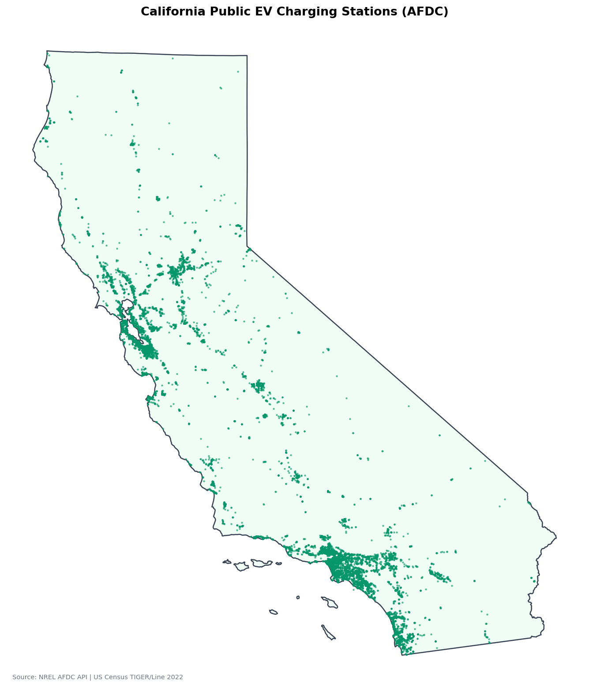
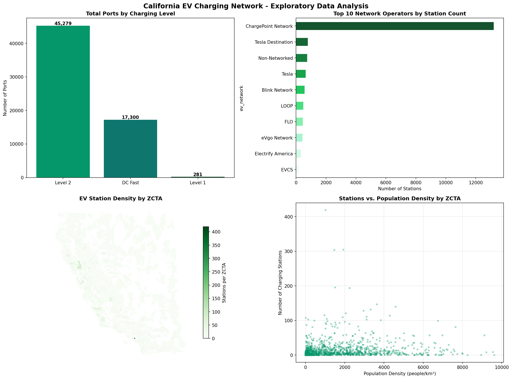
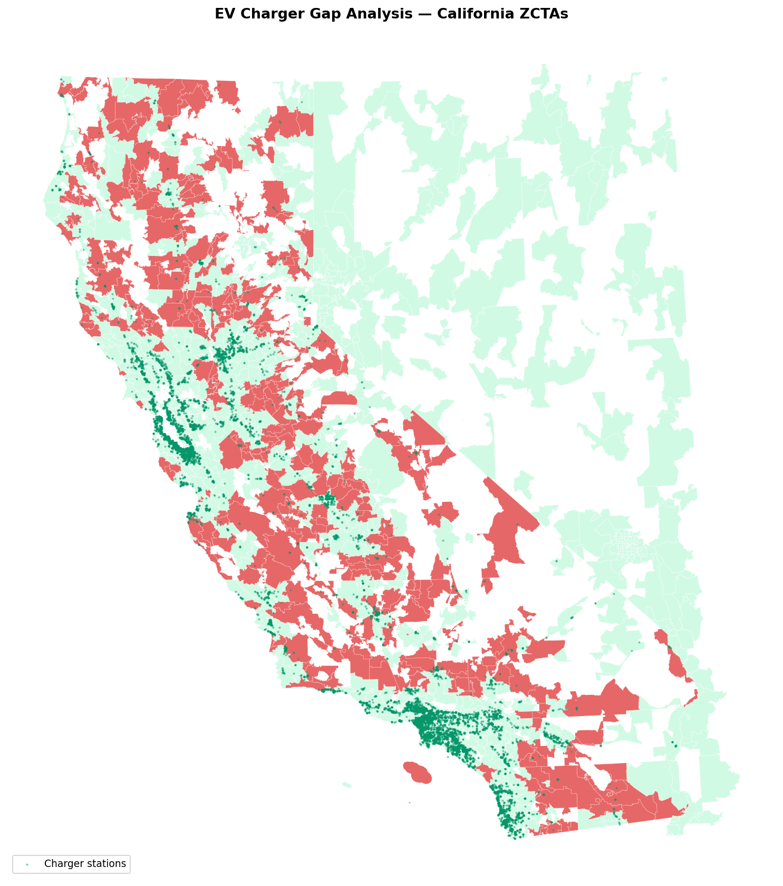
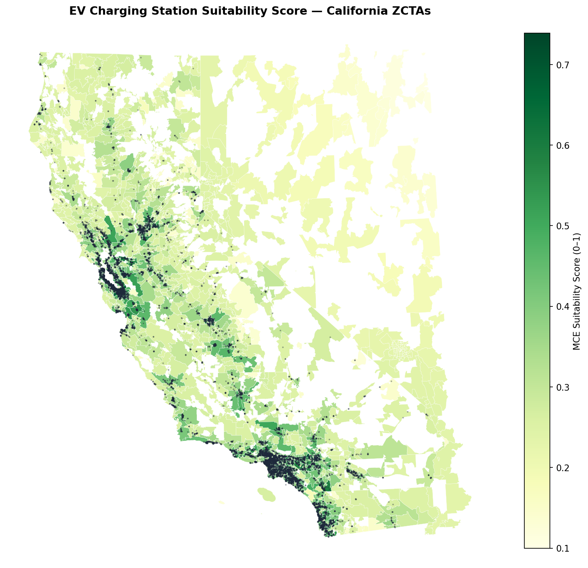
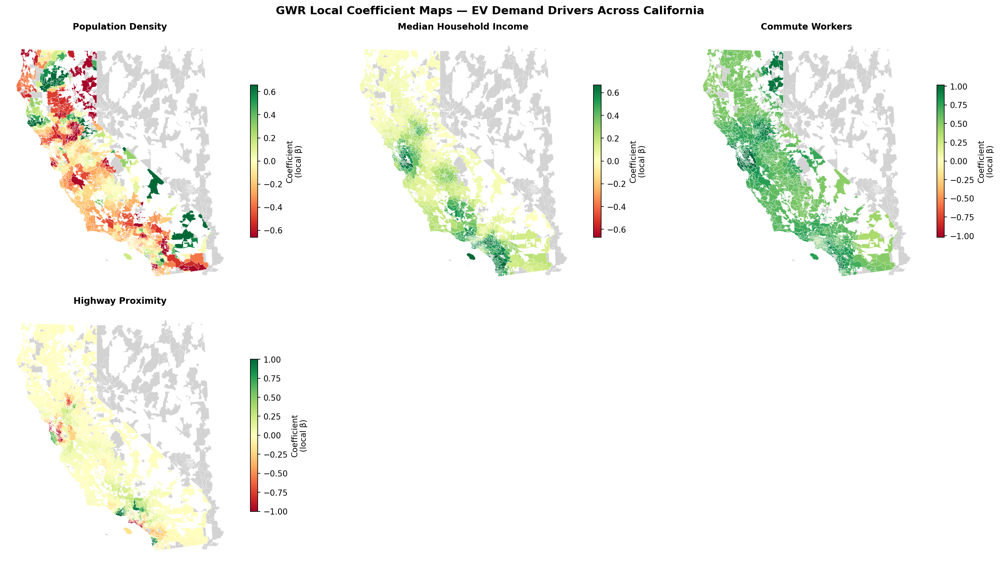
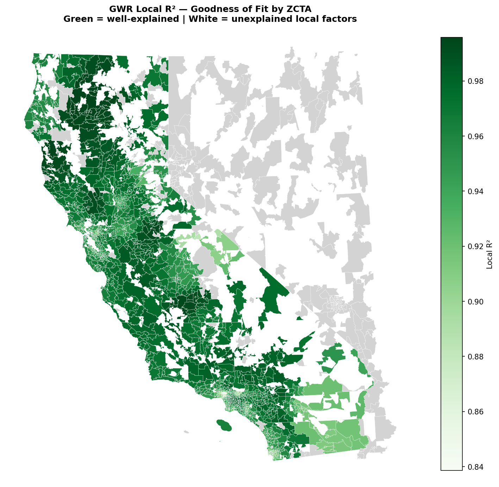

# EV Charging Station Site Suitability Analysis — California

**GIS Data Science Portfolio | Project 02**

A data-driven site suitability model identifying the highest-priority locations for new public EV charging stations in California. Integrates live federal station data, Census demographics, and spatial machine learning into a reproducible six-stage analytical pipeline across **2,007 ZIP Code Tabulation Areas (ZCTAs)**.

---

## 🗺️ Interactive Dashboard

> 📍 **[View EV Site Suitability Map](https://drive.google.com/file/d/1-9dDOX4KlTbAX_Nhvs55E2ekhkO6lzM5/view?usp=drive_link)** — MCE scores · Gap zones · Existing stations · Top-20 candidate sites

---

## Headline Results

| Metric | Value |
|--------|-------|
| Public EV stations analyzed | 18,957 |
| Total charging ports | 62,860 (45,279 L2 · 17,300 DC Fast · 281 L1) |
| California ZCTAs analyzed | 2,007 |
| ZCTAs with adequate coverage | 1,283 (63.9%) |
| **Underserved ZCTAs (gap zones)** | **343 (17.1%)** |
| **People in gap zones** | **2,573,537** |
| Total EV registrations (CA) | 1,761,634 |
| GWR Global R² | **0.9777** (vs. OLS 0.9100) |
| GWR Mean Local R² | **0.961** |
| Optimal GWR bandwidth | 52 nearest neighbours (AICc) |
| Moran's I on OLS residuals | 0.2275 (p = 0.001) — GWR justified |

---

## Visualizations

### Station Distribution

*18,957 public EV charging stations across California (NREL AFDC API). Station density is heavily concentrated along the coast and in the LA Basin, with large inland gaps visible across the Central Valley and desert regions.*

---

### Exploratory Data Analysis

*Top-left: Level 2 dominates at 72% of all ports (45,279), reflecting lower install costs vs. DC Fast. Top-right: ChargePoint operates 13,000+ stations — nearly 3× the next largest operator. Bottom-left: Station density by ZCTA confirms coastal concentration. Bottom-right: Population density vs. station count shows a weak correlation, indicating many dense ZCTAs remain underserved.*

---

### DBSCAN Gap Analysis

*Red ZCTAs are underserved gap zones — their centroids fall outside an 8 km radius of any charger cluster and have populations ≥ 500. Green ZCTAs have adequate coverage. 343 ZCTAs (17.1%) are gaps, housing 2.57 million people. The Central Valley, Sierra Nevada foothills, and Inland Empire show the highest concentration of gaps.*

---

### MCE Suitability Score

*Composite suitability score (0–1) weighted across five criteria: EV registrations (0.35), population density (0.20), commute workers (0.20), median income (0.15), and charger gap score (0.10). Darker green = higher priority for new infrastructure. Black dots = existing stations. High-scoring ZCTAs in the Central Valley and Inland Empire represent the most actionable investment targets.*

---

### GWR Local Coefficient Maps

*Each map shows how the relationship between a demand driver and EV registrations varies spatially. Green = positive coefficient (feature drives EV demand locally), red = negative. Key findings: commute workers show a consistently positive effect statewide; income has a stronger positive effect in coastal metros than inland CA; population density has a mixed signal in dense urban cores where congestion may suppress EV adoption.*

---

### GWR Local R² — Goodness of Fit

*Local R² ranges from 0.84 to 0.996 with a mean of 0.961 — the four-feature model explains EV demand very well across nearly all of California. Grey ZCTAs were excluded from GWR due to missing feature data. The few lower-R² zones in the southern Inland Empire suggest local factors (e.g. fleet vehicle adoption, commercial EV incentives) not captured in the current feature set.*

---

## Top 20 Candidate Sites

Sites ranked by MCE composite suitability score. All confirmed gap zones (>8 km from nearest charger cluster) with population ≥ 500.

| Rank | ZCTA | Score | Population | EV Regs | Med. Income | Commuters | Curr. Stations | Gap (km) |
|------|------|-------|-----------|---------|-------------|-----------|---------------|----------|
| 1 | 93536 | 0.5086 | 73,417 | 3,303 | $89,987 | 29,627 | 10 | 8.9 |
| 2 | 93619 | 0.4591 | 48,320 | 2,934 | $121,444 | 21,063 | 0 | 3.5 |
| 3 | 93306 | 0.4512 | 74,518 | 2,267 | $60,857 | 28,511 | 3 | 3.9 |
| 4 | 93311 | 0.4417 | 48,722 | 2,471 | $101,447 | 21,992 | 11 | 5.2 |
| 5 | 93117 | 0.4406 | 54,915 | 2,140 | $77,964 | 26,925 | 34 | 1.5 |
| 6 | 93257 | 0.4374 | 78,754 | 1,906 | $48,411 | 30,031 | 11 | 5.8 |
| 7 | 93535 | 0.4324 | 79,522 | 2,050 | $51,560 | 26,979 | 15 | 3.7 |
| 8 | 95973 | 0.3855 | 38,490 | 1,544 | $80,249 | 19,010 | 2 | 5.1 |
| 9 | 92544 | 0.3844 | 52,364 | 1,515 | $57,881 | 19,669 | 2 | 5.8 |
| 10 | 93454 | 0.3780 | 41,324 | 1,511 | $73,166 | 17,741 | 39 | 0.4 |
| 11 | 93308 | 0.3768 | 54,857 | 1,357 | $49,490 | 19,652 | 21 | 2.7 |
| 12 | 95991 | 0.3706 | 43,028 | 1,261 | $58,632 | 17,632 | 3 | 1.5 |
| 13 | 91384 | 0.3689 | 28,693 | 1,719 | $119,866 | 11,069 | 1 | 0.2 |
| 14 | 92307 | 0.3658 | 40,604 | 1,412 | $69,595 | 15,031 | 3 | 3.3 |
| 15 | 93637 | 0.3653 | 40,996 | 1,380 | $67,333 | 15,876 | 9 | 2.3 |
| 16 | 92236 | 0.3600 | 42,218 | 857 | $40,641 | 20,583 | 2 | 2.0 |
| 17 | 93105 | 0.3593 | 26,382 | 1,438 | $109,018 | 12,911 | 4 | 1.2 |
| 18 | 93657 | 0.3551 | 35,854 | 1,147 | $63,994 | 15,205 | 4 | 6.0 |
| 19 | 95219 | 0.3550 | 30,242 | 1,269 | $83,934 | 13,768 | 7 | 4.5 |
| 20 | 95363 | 0.3493 | 29,364 | 1,225 | $83,458 | 12,807 | 8 | 5.4 |

*Full table: [`outputs/top20_candidate_sites.csv`](outputs/top20_candidate_sites.csv)*

---

## Six-Stage Pipeline

```
AFDC API ──┐
Census ACS ─┼──► Data Acquisition ──► EDA ──► DBSCAN Gap Detection
OSM/TIGER ─┘                                        │
                                                     ▼
                                    MCE Scoring ◄── Gap Zones
                                         │
                                         ▼
                              Moran's I Diagnostic
                                         │
                                         ▼
                                   GWR Modeling
                                         │
                                         ▼
                          Interactive Map + Top-20 Report
```

### Stage 1 — Data Acquisition
- **AFDC API** (NREL): 18,957 open public EVSE locations with port-type breakdown
- **Census TIGER/Line 2022**: California ZCTA boundaries (2,007 units)
- **Census ACS 5-Year (2021)**: Population, median income, commute workers, housing units
- **CA DMV Open Data**: EV registration counts by ZIP code (1,761,634 total EVs)

### Stage 2 — Exploratory Data Analysis
- Port-type composition: Level 2 dominates at 72% of all ports
- Network operator breakdown: ChargePoint leads with 13,000+ stations
- Station density choropleth by ZCTA
- Stations vs. population density scatter — reveals the urban concentration pattern

### Stage 3 — DBSCAN Gap Detection
Using DBSCAN *inversely* — clustering existing stations to define coverage zones, then flagging ZCTAs outside those zones as gaps.

- `eps = 8,000 m` · `min_pts = 3`
- **149 clusters** · **177 isolated stations** (0.9%)
- Largest cluster: 7,475 stations (coastal LA/Orange County corridor)
- **343 underserved ZCTAs** · **2.57 million people** in gap zones

### Stage 4 — Multi-Criteria Evaluation (MCE)

| Criterion | Weight | Rationale |
|-----------|--------|-----------|
| EV Registrations | 0.35 | Most direct signal of where EVs are |
| Population Density | 0.20 | Concentration of potential users |
| Commute Workers | 0.20 | Workplace charging demand proxy |
| Median Income | 0.15 | Purchasing power / adoption likelihood |
| Charger Gap Score | 0.10 | Inverse of existing coverage |

### Stage 5 — Moran's I Diagnostic
- Global OLS R² = 0.9100
- Moran's I on OLS residuals = **0.2275 (p = 0.001)**
- Significant positive spatial autocorrelation → GWR is statistically justified

### Stage 6 — Geographically Weighted Regression (GWR)
- **Bandwidth**: 52 nearest neighbours (AICc golden-section search)
- **Kernel**: bisquare adaptive
- **GWR R²**: 0.9777 · **Adjusted R²**: 0.9714
- **Local R² range**: 0.839 – 0.996 · **Mean**: 0.961
- Commute workers show the most consistent positive effect statewide
- Income effect strongest in coastal metros, weaker in inland CA

---

## Repository Structure

```
ev-charging-suitability-ca/
├── EV_Station_Suitability_Analysis.ipynb   # Full analysis notebook
├── README.md
├── environment.yml                          # Conda environment
└── outputs/
    ├── 01_stations_raw.png                  # Station distribution map
    ├── 02_eda_panels.png                    # 4-panel EDA chart
    ├── 03_gap_analysis.png                  # DBSCAN gap zones map
    ├── 04_mce_suitability.png               # MCE suitability choropleth
    ├── 05_gwr_coefficients.png              # GWR local coefficient maps
    ├── 06_gwr_local_r2.png                  # GWR local R² map
    ├── 06_ev_suitability_map.html           # Interactive Folium map
    └── top20_candidate_sites.csv            # Ranked candidate sites
```

---

## Data Sources

| Dataset | Source | Year | License |
|---------|--------|------|---------|
| EV Charging Stations | [NREL AFDC API](https://developer.nrel.gov/docs/transportation/alt-fuel-stations-v1/) | 2024 | Public |
| ZCTA Boundaries | [US Census TIGER/Line](https://www.census.gov/geographies/mapping-files/time-series/geo/tiger-line-file.html) | 2022 | Public Domain |
| State Boundary | [US Census Cartographic Boundary](https://www.census.gov/geographies/mapping-files/time-series/geo/cartographic-boundary.html) | 2022 | Public Domain |
| Demographics | [Census ACS 5-Year](https://www.census.gov/data/developers/data-sets/acs-5year.html) | 2021 | Public Domain |
| EV Registrations | [CA DMV Open Data](https://data.ca.gov/dataset/vehicle-fuel-type-count-by-zip-code) | 2024 | CC BY |

---

## Tech Stack

```
Python 3.11
├── geopandas       — spatial data handling and choropleth mapping
├── pandas / numpy  — data wrangling
├── scikit-learn    — DBSCAN clustering, MinMaxScaler
├── libpysal        — spatial weights (KNN)
├── esda            — Moran's I spatial autocorrelation test
├── mgwr            — Geographically Weighted Regression
├── folium          — interactive web map
├── matplotlib      — static charts and maps
├── requests        — API data retrieval
└── tqdm            — progress tracking
```

---

## Getting Started

```bash
git clone https://github.com/Suvamp/ev-charging-suitability-ca.git
cd ev-charging-suitability-ca
conda env create -f environment.yml
conda activate ev_suitability
jupyter lab EV_Station_Suitability_Analysis.ipynb
```

Get a free NREL API key at [developer.nrel.gov/signup](https://developer.nrel.gov/signup/) and paste it into the config cell before running.

---

## Limitations

- OSM highway features excluded due to state-level query performance constraints; highway access proxied through cached distances where available
- EV registration data sourced from CA DMV Open Data; falls back to income-based proxy if API is unavailable
- ZCTAs do not perfectly align with administrative boundaries; some gap zones near county borders may have coverage from adjacent ZCTAs not captured in the model
- GWR bandwidth of 52 neighbours produces highly local models; results in sparse rural areas should be interpreted cautiously

---

## License

MIT License — data sources retain their original licenses (see table above).
